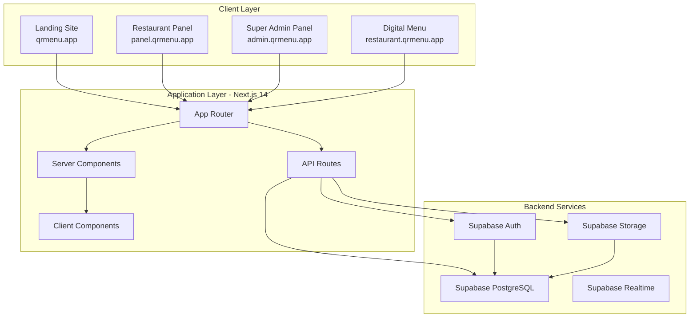

# Design Document

## Overview

QR Menu SaaS is a multi-tenant platform built with Next.js 14 (App Router), Supabase, and deployed on Vercel. The system consists of four main applications served through subdomain routing: Landing Site, Restaurant Panel, Super Admin Panel, and Digital Menu. The architecture leverages Supabase for authentication, database, and storage, while Vercel handles hosting and subdomain routing.

## Architecture

### High-Level Architecture



### Technology Stack

**Frontend:**
- Next.js 14+ with App Router
- TypeScript for type safety
- Tailwind CSS for styling
- shadcn/ui for UI components
- React Hook Form for form management
- Zod for validation

**Backend:**
- Next.js API Routes for custom endpoints
- Supabase Client for database operations
- Supabase Auth for authentication
- Supabase Storage for file uploads

**Database:**
- Supabase PostgreSQL
- Row Level Security (RLS) policies

**Deployment:**
- Vercel for hosting
- Vercel Edge Config for subdomain routing
- Environment variables for configuration

**Additional Services:**
- QR Code generation: qrcode.react library
- Image optimization: Next.js Image component
- Analytics: Custom implementation with Supabase

### Subdomain Routing Strategy

The platform uses subdomain-based routing to serve different applications:

1. **Main Domain** (qrmenu.app): Landing Site
2. **Panel Subdomain** (panel.qrmenu.app): Restaurant Panel
3. **Admin Subdomain** (admin.qrmenu.app): Super Admin Panel
4. **Restaurant Subdomains** (*.qrmenu.app): Digital Menus

**Implementation:**
- Vercel wildcard domain configuration
- Next.js middleware for subdomain detection
- Dynamic routing based on subdomain prefix
- Separate layouts for each application type

## Components and Interfaces

### Database Schema

```sql
-- Users table (managed by Supabase Auth)
-- Extended with custom profile data

-- Restaurants table
CREATE TABLE restaurants (
  id UUID PRIMARY KEY DEFAULT uuid_generate_v4(),
  owner_id UUID REFERENCES auth.users(id) ON DELETE CASCADE,
  name TEXT NOT NULL,
  slug TEXT UNIQUE NOT NULL,
  email TEXT,
  phone TEXT,
  logo_url TEXT,
  cover_image_url TEXT,
  primary_color TEXT DEFAULT '#000000',
  secondary_color TEXT DEFAULT '#ffffff',
  theme_id TEXT DEFAULT 'default',
  primary_language TEXT DEFAULT 'tr',
  currency TEXT DEFAULT 'TRY',
  subscription_status TEXT DEFAULT 'trial',
  subscription_plan TEXT,
  subscription_expires_at TIMESTAMP,
  created_at TIMESTAMP DEFAULT NOW(),
  updated_at TIMESTAMP DEFAULT NOW()
);

-- Categories table
CREATE TABLE categories (
  id UUID PRIMARY KEY DEFAULT uuid_generate_v4(),
  restaurant_id UUID REFERENCES restaurants(id) ON DELETE CASCADE,
  name TEXT NOT NULL,
  name_en TEXT,
  display_order INTEGER DEFAULT 0,
  created_at TIMESTAMP DEFAULT NOW(),
  updated_at TIMESTAMP DEFAULT NOW()
);

-- Products table
CREATE TABLE products (
  id UUID PRIMARY KEY DEFAULT uuid_generate_v4(),
  restaurant_id UUID REFERENCES restaurants(id) ON DELETE CASCADE,
  category_id UUID REFERENCES categories(id) ON DELETE SET NULL,
  name TEXT NOT NULL,
  name_en TEXT,
  description TEXT,
  description_en TEXT,
  price DECIMAL(10,2) NOT NULL,
  image_url TEXT,
  allergens TEXT[], -- Array of allergen strings
  is_available BOOLEAN DEFAULT true,
  display_order INTEGER DEFAULT 0,
  created_at TIMESTAMP DEFAULT NOW(),
  updated_at TIMESTAMP DEFAULT NOW()
);

-- QR Codes table
CREATE TABLE qr_codes (
  id UUID PRIMARY KEY DEFAULT uuid_generate_v4(),
  restaurant_id UUID REFERENCES restaurants(id) ON DELETE CASCADE,
  table_number TEXT,
  qr_data TEXT NOT NULL, -- URL with table parameter
  created_at TIMESTAMP DEFAULT NOW()
);

-- Menu Views table (Analytics)
CREATE TABLE menu_views (
  id UUID PRIMARY KEY DEFAULT uuid_generate_v4(),
  restaurant_id UUID REFERENCES restaurants(id) ON DELETE CASCADE,
  table_number TEXT,
  viewed_at TIMESTAMP DEFAULT NOW(),
  user_agent TEXT,
  ip_address TEXT
);

-- Payments table
CREATE TABLE payments (
  id UUID PRIMARY KEY DEFAULT uuid_generate_v4(),
  restaurant_id UUID REFERENCES restaurants(id) ON DELETE CASCADE,
  amount DECIMAL(10,2) NOT NULL,
  currency TEXT DEFAULT 'TRY',
  status TEXT DEFAULT 'pending', -- pending, completed, failed
  payment_method TEXT,
  transaction_id TEXT,
  created_at TIMESTAMP DEFAULT NOW()
);

-- Admin Users table
CREATE TABLE admin_users (
  id UUID PRIMARY KEY DEFAULT uuid_generate_v4(),
  user_id UUID REFERENCES auth.users(id) ON DELETE CASCADE,
  role TEXT DEFAULT 'super_admin',
  created_at TIMESTAMP DEFAULT NOW()
);
```

### Row Level Security (RLS) Policies

```sql
-- Restaurants: Owners can only see/edit their own restaurant
ALTER TABLE restaurants ENABLE ROW LEVEL SECURITY;

CREATE POLICY "Restaurant owners can view own restaurant"
  ON restaurants FOR SELECT
  USING (auth.uid() = owner_id);

CREATE POLICY "Restaurant owners can update own restaurant"
  ON restaurants FOR UPDATE
  USING (auth.uid() = owner_id);

-- Categories: Owners can manage their restaurant's categories
ALTER TABLE categories ENABLE ROW LEVEL SECURITY;

CREATE POLICY "Restaurant owners can manage own categories"
  ON categories FOR ALL
  USING (
    restaurant_id IN (
      SELECT id FROM restaurants WHERE owner_id = auth.uid()
    )
  );

-- Products: Owners can manage their restaurant's products
ALTER TABLE products ENABLE ROW LEVEL SECURITY;

CREATE POLICY "Restaurant owners can manage own products"
  ON products FOR ALL
  USING (
    restaurant_id IN (
      SELECT id FROM restaurants WHERE owner_id = auth.uid()
    )
  );

-- Public read access for digital menus (no auth required)
CREATE POLICY "Public can view products"
  ON products FOR SELECT
  USING (true);

CREATE POLICY "Public can view categories"
  ON categories FOR SELECT
  USING (true);

CREATE POLICY "Public can view restaurants"
  ON restaurants FOR SELECT
  USING (true);
```

### API Routes Structure

```
/app/api/
├── auth/
│   ├── register/route.ts          # Restaurant registration
│   ├── login/route.ts              # Authentication
│   └── reset-password/route.ts     # Password reset
├── restaurants/
│   ├── route.ts                    # GET, PATCH restaurant
│   └── [id]/
│       ├── categories/route.ts     # Category CRUD
│       ├── products/route.ts       # Product CRUD
│       ├── qr-codes/route.ts       # QR generation
│       └── analytics/route.ts      # View statistics
├── admin/
│   ├── restaurants/route.ts        # List all restaurants
│   ├── payments/route.ts           # Payment tracking
│   └── stats/route.ts              # Platform statistics
└── upload/route.ts                 # File upload handler
```

### Component Architecture

**Landing Site Components:**
- `HeroSection`: Main banner with CTA
- `FeaturesSection`: Platform features showcase
- `PricingSection`: Subscription plans
- `ExamplesSection`: Demo menus
- `ContactSection`: Support information

**Restaurant Panel Components:**
- `DashboardLayout`: Main layout with sidebar navigation
- `CategoryManager`: Category CRUD interface
- `ProductManager`: Product CRUD with image upload
- `QRCodeGenerator`: QR creation and download
- `ThemeCustomizer`: Visual customization panel
- `AnalyticsDashboard`: View statistics and charts
- `SettingsPanel`: Restaurant settings

**Digital Menu Components:**
- `MenuHeader`: Logo and restaurant info
- `CategoryNav`: Category navigation tabs
- `ProductCard`: Individual product display
- `ProductModal`: Detailed product view
- `LanguageSwitcher`: Language toggle
- `TableIndicator`: Table number display

**Super Admin Panel Components:**
- `AdminLayout`: Admin dashboard layout
- `RestaurantList`: All restaurants table
- `RestaurantDetails`: Individual restaurant view
- `PaymentList`: Payment transactions
- `PlatformStats`: System-wide metrics

### Middleware Configuration

```typescript
// middleware.ts
import { NextResponse } from 'next/server'
import type { NextRequest } from 'next/server'

export function middleware(request: NextRequest) {
  const hostname = request.headers.get('host') || ''
  const url = request.nextUrl
  
  // Extract subdomain
  const subdomain = hostname.split('.')[0]
  
  // Main domain - Landing Site
  if (hostname === 'qrmenu.app' || hostname === 'www.qrmenu.app') {
    return NextResponse.rewrite(new URL('/landing', request.url))
  }
  
  // Panel subdomain - Restaurant Panel
  if (subdomain === 'panel') {
    return NextResponse.rewrite(new URL('/panel', request.url))
  }
  
  // Admin subdomain - Super Admin Panel
  if (subdomain === 'admin') {
    return NextResponse.rewrite(new URL('/admin', request.url))
  }
  
  // Restaurant subdomain - Digital Menu
  // Pass subdomain as search param for restaurant lookup
  url.searchParams.set('restaurant', subdomain)
  return NextResponse.rewrite(new URL(`/menu${url.pathname}${url.search}`, request.url))
}

export const config = {
  matcher: ['/((?!api|_next/static|_next/image|favicon.ico).*)'],
}
```

## Data Models

### TypeScript Interfaces

```typescript
// types/database.ts

export interface Restaurant {
  id: string
  owner_id: string
  name: string
  slug: string
  email?: string
  phone?: string
  logo_url?: string
  cover_image_url?: string
  primary_color: string
  secondary_color: string
  theme_id: string
  primary_language: 'tr' | 'en'
  currency: 'TRY' | 'USD' | 'EUR'
  subscription_status: 'trial' | 'active' | 'expired' | 'cancelled'
  subscription_plan?: string
  subscription_expires_at?: string
  created_at: string
  updated_at: string
}

export interface Category {
  id: string
  restaurant_id: string
  name: string
  name_en?: string
  display_order: number
  created_at: string
  updated_at: string
}

export interface Product {
  id: string
  restaurant_id: string
  category_id?: string
  name: string
  name_en?: string
  description?: string
  description_en?: string
  price: number
  image_url?: string
  allergens?: string[]
  is_available: boolean
  display_order: number
  created_at: string
  updated_at: string
}

export interface QRCode {
  id: string
  restaurant_id: string
  table_number?: string
  qr_data: string
  created_at: string
}

export interface MenuView {
  id: string
  restaurant_id: string
  table_number?: string
  viewed_at: string
  user_agent?: string
  ip_address?: string
}

export interface Payment {
  id: string
  restaurant_id: string
  amount: number
  currency: string
  status: 'pending' | 'completed' | 'failed'
  payment_method?: string
  transaction_id?: string
  created_at: string
}

export interface AdminUser {
  id: string
  user_id: string
  role: 'super_admin'
  created_at: string
}
```

### Form Validation Schemas

```typescript
// lib/validations.ts
import { z } from 'zod'

export const restaurantRegistrationSchema = z.object({
  name: z.string().min(2, 'Restaurant name must be at least 2 characters'),
  email: z.string().email('Invalid email address'),
  password: z.string()
    .min(8, 'Password must be at least 8 characters')
    .regex(/[A-Z]/, 'Password must contain at least one uppercase letter')
    .regex(/[a-z]/, 'Password must contain at least one lowercase letter')
    .regex(/[0-9]/, 'Password must contain at least one number'),
  phone: z.string().optional(),
})

export const categorySchema = z.object({
  name: z.string().min(1, 'Category name is required'),
  name_en: z.string().optional(),
  display_order: z.number().int().min(0).default(0),
})

export const productSchema = z.object({
  name: z.string().min(1, 'Product name is required'),
  name_en: z.string().optional(),
  description: z.string().optional(),
  description_en: z.string().optional(),
  price: z.number().positive('Price must be positive'),
  category_id: z.string().uuid().optional(),
  allergens: z.array(z.string()).optional(),
  is_available: z.boolean().default(true),
})

export const themeCustomizationSchema = z.object({
  primary_color: z.string().regex(/^#[0-9A-F]{6}$/i, 'Invalid color format'),
  secondary_color: z.string().regex(/^#[0-9A-F]{6}$/i, 'Invalid color format'),
  theme_id: z.string(),
})
```

## Error Handling

### Error Response Format

```typescript
// lib/errors.ts

export class AppError extends Error {
  constructor(
    public statusCode: number,
    public message: string,
    public code?: string
  ) {
    super(message)
    this.name = 'AppError'
  }
}

export const errorHandler = (error: unknown) => {
  if (error instanceof AppError) {
    return {
      error: {
        message: error.message,
        code: error.code,
        statusCode: error.statusCode,
      }
    }
  }
  
  // Supabase errors
  if (error && typeof error === 'object' && 'code' in error) {
    return {
      error: {
        message: 'Database operation failed',
        code: (error as any).code,
        statusCode: 500,
      }
    }
  }
  
  // Unknown errors
  return {
    error: {
      message: 'An unexpected error occurred',
      statusCode: 500,
    }
  }
}
```

### Error Handling Strategy

1. **API Routes**: Use try-catch blocks and return standardized error responses
2. **Client Components**: Use error boundaries and toast notifications
3. **Server Components**: Use error.tsx files for error UI
4. **Form Validation**: Display inline validation errors using React Hook Form
5. **Authentication Errors**: Redirect to login with error message
6. **File Upload Errors**: Show user-friendly messages for size/type issues

### Common Error Scenarios

- **Authentication Failures**: Invalid credentials, expired sessions
- **Authorization Failures**: Accessing resources without permission
- **Validation Errors**: Invalid form data, missing required fields
- **Database Errors**: Connection issues, constraint violations
- **File Upload Errors**: Size limits, unsupported formats
- **Subdomain Errors**: Non-existent restaurant, invalid slug
- **Payment Errors**: Failed transactions, expired subscriptions

## Testing Strategy

### Unit Testing

**Tools**: Jest, React Testing Library

**Coverage Areas:**
- Validation schemas (Zod)
- Utility functions (slug generation, price formatting)
- Component logic (form handlers, state management)
- API route handlers (business logic)

**Example Test:**
```typescript
// __tests__/lib/validations.test.ts
import { productSchema } from '@/lib/validations'

describe('productSchema', () => {
  it('should validate valid product data', () => {
    const validProduct = {
      name: 'Pizza Margherita',
      price: 89.90,
      is_available: true,
    }
    expect(() => productSchema.parse(validProduct)).not.toThrow()
  })
  
  it('should reject negative prices', () => {
    const invalidProduct = {
      name: 'Pizza',
      price: -10,
    }
    expect(() => productSchema.parse(invalidProduct)).toThrow()
  })
})
```

### Integration Testing

**Tools**: Playwright, Vitest

**Coverage Areas:**
- Authentication flow (register, login, logout)
- CRUD operations (categories, products)
- File upload functionality
- QR code generation
- Subdomain routing

**Example Test:**
```typescript
// __tests__/integration/auth.test.ts
import { test, expect } from '@playwright/test'

test('restaurant registration flow', async ({ page }) => {
  await page.goto('https://panel.qrmenu.app/register')
  
  await page.fill('[name="name"]', 'Test Restaurant')
  await page.fill('[name="email"]', 'test@example.com')
  await page.fill('[name="password"]', 'Test1234')
  
  await page.click('button[type="submit"]')
  
  await expect(page).toHaveURL(/.*panel.*dashboard/)
})
```

### End-to-End Testing

**Scenarios:**
1. Complete restaurant onboarding flow
2. Menu creation and QR code generation
3. Customer scanning QR and viewing menu
4. Admin monitoring restaurant activity

### Manual Testing Checklist

- [ ] Responsive design on mobile, tablet, desktop
- [ ] Cross-browser compatibility (Chrome, Safari, Firefox)
- [ ] Image upload and optimization
- [ ] QR code scanning with real devices
- [ ] Subdomain routing in production
- [ ] Payment integration (sandbox mode)
- [ ] Multi-language content display
- [ ] Theme customization preview

## Deployment Architecture

### Vercel Configuration

```json
// vercel.json
{
  "buildCommand": "npm run build",
  "devCommand": "npm run dev",
  "installCommand": "npm install",
  "framework": "nextjs",
  "regions": ["fra1"],
  "env": {
    "NEXT_PUBLIC_SUPABASE_URL": "@supabase-url",
    "NEXT_PUBLIC_SUPABASE_ANON_KEY": "@supabase-anon-key",
    "SUPABASE_SERVICE_ROLE_KEY": "@supabase-service-key"
  }
}
```

### Environment Variables

```bash
# .env.local (development)
NEXT_PUBLIC_SUPABASE_URL=https://xxx.supabase.co
NEXT_PUBLIC_SUPABASE_ANON_KEY=xxx
SUPABASE_SERVICE_ROLE_KEY=xxx
NEXT_PUBLIC_APP_URL=http://localhost:3000
```

### Domain Configuration

1. **Main Domain**: qrmenu.app → Vercel project
2. **Wildcard Subdomain**: *.qrmenu.app → Same Vercel project
3. **DNS Records**:
   - A record: @ → Vercel IP
   - CNAME record: * → cname.vercel-dns.com

### Supabase Configuration

**Database Setup:**
1. Create new Supabase project
2. Run SQL migrations for schema creation
3. Enable Row Level Security policies
4. Configure storage buckets for images

**Storage Buckets:**
- `restaurant-logos`: Public bucket for logos
- `restaurant-covers`: Public bucket for cover images
- `product-images`: Public bucket for product photos

**Authentication Settings:**
- Enable email/password authentication
- Configure email templates (welcome, password reset)
- Set JWT expiration to 7 days
- Enable email confirmation

### Performance Optimization

1. **Image Optimization**: Use Next.js Image component with Supabase CDN
2. **Caching**: Implement ISR for digital menus (revalidate every 60 seconds)
3. **Database Indexing**: Add indexes on frequently queried columns (slug, restaurant_id)
4. **Edge Functions**: Use Vercel Edge for subdomain routing
5. **Code Splitting**: Lazy load admin panel components

### Monitoring and Logging

- **Vercel Analytics**: Track page views and performance
- **Supabase Logs**: Monitor database queries and errors
- **Error Tracking**: Implement Sentry for error reporting
- **Custom Analytics**: Track menu views in database

## Security Considerations

### Authentication Security

- Password hashing handled by Supabase Auth
- JWT tokens with secure httpOnly cookies
- CSRF protection via SameSite cookies
- Rate limiting on authentication endpoints

### Data Security

- Row Level Security policies on all tables
- Input validation on all forms
- SQL injection prevention via parameterized queries
- XSS prevention via React's built-in escaping

### File Upload Security

- File type validation (images only)
- File size limits (5MB for images)
- Virus scanning via Supabase Storage
- Secure URLs with signed tokens for private files

### API Security

- Authentication required for all protected routes
- Role-based access control (restaurant owner vs admin)
- Rate limiting on public endpoints
- CORS configuration for allowed origins

## Scalability Considerations

### Database Optimization

- Indexes on foreign keys and frequently queried columns
- Pagination for large datasets
- Connection pooling via Supabase
- Read replicas for analytics queries

### Caching Strategy

- Static generation for landing site
- ISR for digital menus (60s revalidation)
- Client-side caching for restaurant panel
- CDN caching for images

### Multi-Tenancy

- Tenant isolation via restaurant_id in all queries
- Separate subdomain per restaurant
- Shared database with RLS policies
- Horizontal scaling via Vercel's infrastructure

## Future Enhancements

### Phase 2 Features

- Online ordering integration
- Table reservation system
- Customer reviews and ratings
- Loyalty program
- Email marketing campaigns

### Phase 3 Features

- Mobile app for restaurant owners
- Advanced analytics (popular items, peak hours)
- Multi-location support
- Staff management
- Inventory tracking

### Technical Improvements

- GraphQL API with Apollo
- Real-time menu updates via Supabase Realtime
- Progressive Web App (PWA) for digital menus
- A/B testing for menu layouts
- AI-powered menu recommendations
